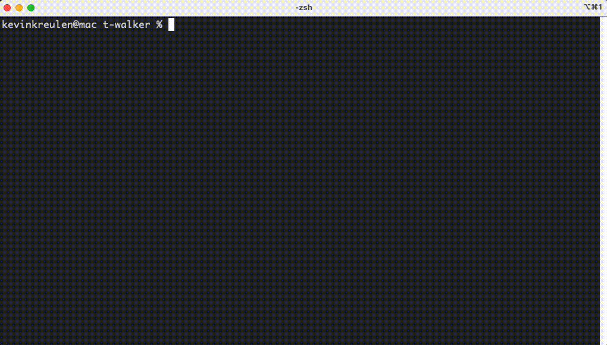

# T-Walker

T-Walker is a simple terminal user interface designed to be the quickest way to navigate directories and quickly edit files.

## Installation
Installing T-Walker is simple. Just clone the repository and run the `install` directive from the MakeFile.

The `install` directive assumes that you are using zsh as your shell. If you are using a different shell, you will need to
manually add the `alias t="source /usr/local/bin/t-wrapper.sh"` to your shell's sourcing file.

```bash
git clone https://github.com/kreulenk/t-walker.git
cd t-walker
make install
```

The final `make install` command may require root permissions.

## Usage
To use T-Walker, simply run the `t` command from the terminal. The interface will open and you can navigate directories
with the arrow keys and enter into directories files with the enter key.




The following keybindings are available:
- `Up Arrow` or `k` - Move up one file.
- `Down Arrow` or `j` - Move down one file.
- `Left Arrow` or `h` - Move left one file.
- `Right Arrow` or `l` - Move right one file.
- `Enter` - Enter into a directory.
- `b` - Go back one directory.
- `e` - Edit the selected file. Defaults to vim but this can be overridden using the `EDITOR` environment variable.
- `c` - Change into the selected directory from your shell. This will cause T-walker to exit.
- `r` - Remove the selected file.
- `s` - Search through the files in the current directory.
- `v` - View the selected file using the `less` program.
- `q` - Quit the program.

All filesystem objects are categorized using the following colors:
- `File` - Light Blue
- `Directory` - Dark Blue
- `Symbolic Link Directory` - Purple
